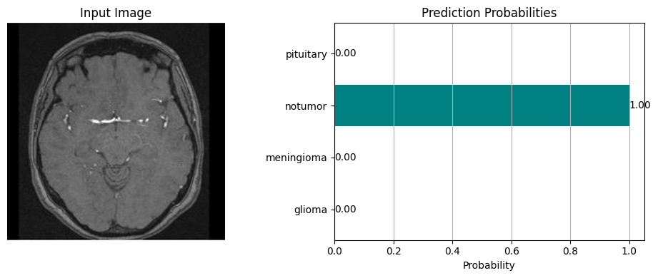
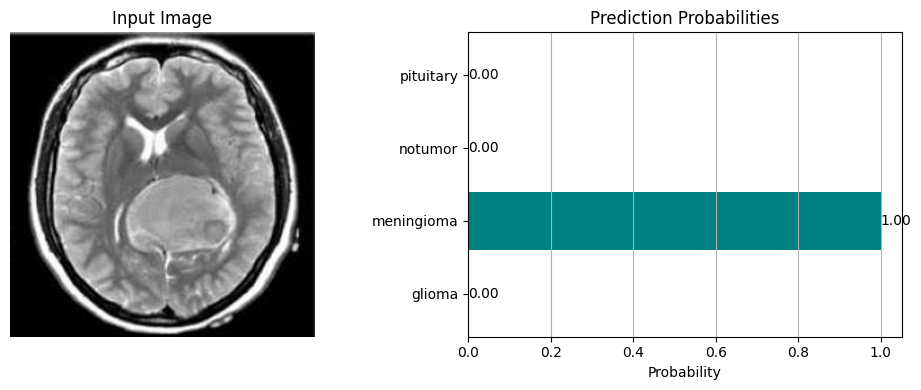
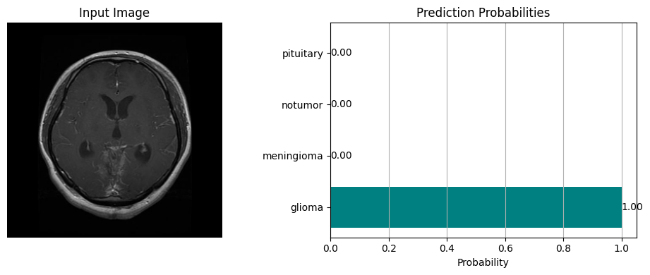

# AI-Assisted-Brain-Tumor-Diagnosis-System

## Overview
This repository implements a deep learning pipeline for classification of brain tumors from MRI scans. The solution leverages **transfer learning** with the **Xception** architecture to classify MRI images into four classes:

- Glioma  
- Meningioma  
- Pituitary  
- No Tumor  

The project focuses on optimizing model accuracy and interpretability through structured preprocessing, data augmentation, and fine-tuning.
All experiments, preprocessing, training, evaluation, and result visualization are implemented and documented within the primary Jupyter Notebook (`AI-Assisted-Brain-Tumor-Diagnosis-System.ipynb`).

---

## Objectives
- Develop a deep learning model using the **Xception architecture** for MRI brain tumor classification.
- Classify MRI scans into four categories: **Glioma**, **Meningioma**, **Pituitary**, and **No Tumor**.
- Train and fine-tune the model using the **Kaggle Brain Tumor MRI dataset**.
- Evaluate the model using **accuracy**, **F1-score**, and **confusion matrix**.
- Visualize results and document outcomes for reproducibility.

---

## Dataset
The dataset used for this project is publicly available on **Kaggle**:

**🔗 [Brain Tumor MRI Dataset (Kaggle)](kaggle.com/datasets/masoudnickparvar/brain-tumor-mri-dataset)**  

**Preprocessing steps include:**
- Resize images to **299×299** pixels (Xception input requirement)  
- Normalize pixel values  
- Data augmentation (rotation, shift, flip, zoom)  
- Stratified train/validation/test split to preserve class balance  

(Refer to the notebook for the dataset link and parameters used.)

---

## **Model Architecture**
- **Base Model:** Xception (pre-trained on ImageNet)  
- **Additional Layers:** Dense, Dropout, Softmax output  
- **Loss Function:** Categorical Crossentropy  
- **Optimizer:** Adam  
- **Training Epochs:** 50  
- **Accuracy Achieved:** ~95% on validation  

| Section           | Description                         | Suggested Visual           |
| ----------------- | ----------------------------------- | -------------------------- |
| Patient Intake    | Form for name, age, gender, history | Patient form UI         |
| Symptom Form      | 10-question radio button survey     | Form UI screenshot      |
| Image Upload      | Accepts .jpg/.png MRI scans         | Sample MRI preview      |
| Model Prediction  | Predicts tumor class                | Horizontal bar chart (probability)|
| Report Generation | Detailed report with all info       | Generated PDF example   |
| GPT-Based Advice  | AI-powered medical suggestion       | Text output from OpenAI |
---

## Output Examples

  

  

  

## **Tools & Technologies**
- **Languages:** Python  
- **Libraries/Frameworks:** TensorFlow, Keras  
- **Supporting Libraries:** NumPy, pandas, scikit-learn, matplotlib, seaborn, PIL  
- **Environment:** Google Colab, Jupyter Notebook  
- **Version Control:** GitHub  

## **KPIs (Key Performance Indicators)**
**1. Data Quality**
- Missing values handled during preprocessing  
- Class balance maintained across four tumor categories  
- Image normalization to 299×299 pixels  

**2. Model Performance**
- Model accuracy: ~95%  
- Base model: Xception (fine-tuned ImageNet weights)  
- Optimizer: Adam, Loss: Categorical Crossentropy  
- Training epochs: 50  

**3. Implementation**
- Model loading from `.h5` file supported  
- Predictions generated from single MRI image input  

---

## Tools & Supporting Libraries
- Python 3.x  
- TensorFlow / Keras  
- NumPy  
- pandas  
- scikit-learn  
- matplotlib  
- seaborn  
- Pillow (PIL)  

---
## Project Documents
- [DEPI PROPOSAL.docx](./DEPI%20PROPOSAL.docx) — Detailed project proposal outlining objectives, timeline, team structure, and methodology.

